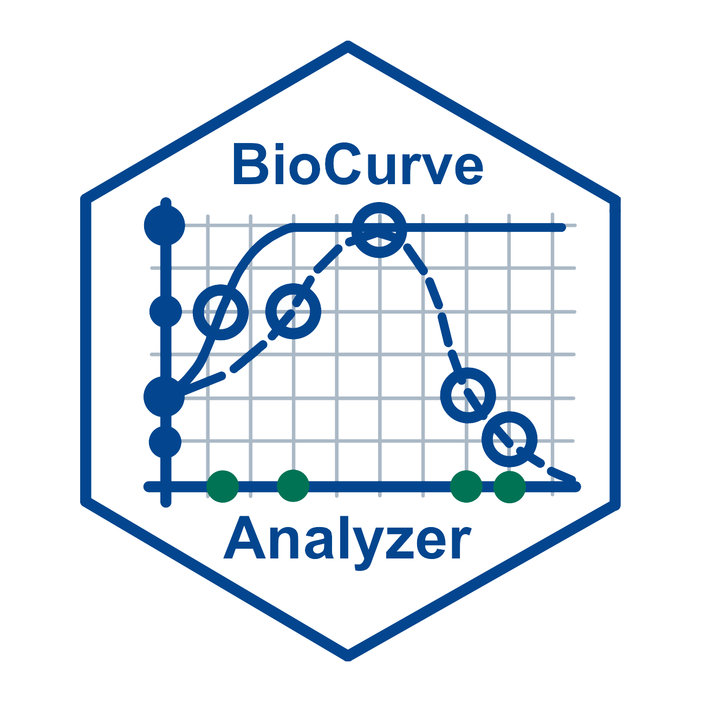

# Biocurve Analyzer  

A shiny app that can estimate ED<sub>50</sub> and T<sub>50</sub> from biological curves.  

## Description

**Biocurve Analyzer** is a tool used to analyze diverse biological curves generated from dose-response and time-to-event data sets in a stepwise manner. It provides a more user-friendly interface to estimating the ED<sub>50</sub> and T<sub>50</sub> from the curves using the R packages - `drc`, `drcte`, and `aomisc`. All frequently used models are available in this app. It also helps the users to select the best-fit model after you provide all possible candidates. In addition, in order to estimate the ED<sub>50</sub>s more comprehensively, two types of ED<sub>50</sub>s can be estimated by three previously published methods. Finally, a publication-quality figure presenting the biological curves can be generated and further customized by the users. All the dataframes, figures, and a report containing the code for plotting can be downloaded. 

## Getting Started

Biocurve Analyzer can be used both locally and online. The app can be installed following the instructions below and it is also hosted on Shinyapps.io: link to the app.  

### Installation

To use Biocurve Analyzer locally, you can follow the steps.  

  1. Install R and RStudio IDE. The app has been tested with R 4.4.1 and RStudio version 2024.04.2+764.  

  2. Clone or download the Biocurve Analyzer from the GitHub. You can either [clone the repository](https://docs.github.com/en/repositories/creating-and-managing-repositories/cloning-a-repository) using git or download the app as a ZIP file.  
  In addition, these R packages should also be installed by from CRAN or GitHub using the code below.  

      ```
      # enabling and customizing the app
      install.packages("shiny", "shinyjs", "shinyalert", "shinycssloaders", "shinyhelper")
      
      # data input and preprocessing
      install.packages("tidyverse", "purrr", "broom", "bigsnpr", "openxlsx")
      
      # data fitting and model selection
      install.packages("drc", "drcte")
      install.packages("devtools")
      devtools::install_github("onofriAndreaPG/aomisc")
      
      # model assessment
      install.packages("scales", "car", "stats")
      
      # generating figures and report
      install.packages("ggplot2", "ggthemes", "ggpubr", "cowplot", "extrafont", "rmarkdown", "knitr", "DT", "kableExtra", "rlist")
      
      ```

  3. Run the shiny app using the following code in RStudio.

      ```
      shiny.runApp()
      ```

### Instructions with examples

To use the app properly, please ensure that your data is in a tidy format with the columns in the right order. We have included two datasets from our previously published paper as examples, which you can download for reference. The detailed tutorial for the app is available [here](./Tutorial.pdf). 

### Help

If you need any help or support related to this app, feel free to contact us at zxing001@ucr.edu, and the issues can also be reported on https://github.com/ZenanXing/Biocurve-Analyzer/issues.  
**Enjoy using the app!**  
[(Back to top)](#biocurve-analyzer)

## License & DOI

This project is licensed under the [NAME HERE] License - see the LICENSE.md file for details, and the DOI for the app is [DOI].
[(Back to top)](#biocurve-analyzer)

## Citations

If you use the Biocurve Analyzer, please cite our paper and the related papers listed below.


- **Our paper:**  
*[ZenanX, xxxxxxxx]*  

- **Generate the curves:**  
*[Ritz C, Baty F, Streibig JC, Gerhard D](https://journals.plos.org/plosone/article?id=10.1371/journal.pone.0146021). Dose-Response Analysis Using R. PLoS One. 2015;10:e0146021.*  

- **ED<sub>50</sub> estimation:**  
  - **Reed-and-Muench Method:**  
  *Reed LJ, Muench H. [A simple method of estimating fifty percent endpoints](https://academic.oup.com/aje/article/27/3/493/99616). Am J Epidemiol. 1938;27:493–7.*  
  *Ramakrishnan MA. [Determination of 50% endpoint titer using a simple formula](https://www.wjgnet.com/2220-3249/full/v5/i2/85.htm). World J Virol. 2016;5:85–6.*  
  
  - **Ritz-Gerhard Method:**  
  *Ritz C, Baty F, Streibig JC, Gerhard D. [Dose-Response Analysis Using R](https://journals.plos.org/plosone/article?id=10.1371/journal.pone.0146021). PLoS One. 2015;10:e0146021.*    
  
  - **Serra-Greco Method:**  
  *Serra A, Saarimäki LA, Fratello M, Marwah VS, Greco D. [BMDx: a graphical Shiny application to perform Benchmark Dose analysis for transcriptomics data](https://academic.oup.com/bioinformatics/article/36/9/2932/5709037). Bioinformatics. 2020;36:2932–3.*  
  
- **T<sub>50</sub> estimation:**  
  *Onofri A, Mesgaran MB, Ritz C. [A unified framework for the analysis of germination, emergence, and other time-to-event data in weed science](https://www.cambridge.org/core/journals/weed-science/article/unified-framework-for-the-analysis-of-germination-emergence-and-other-timetoevent-data-in-weed-science/7DB0E039C9013D3E8F44FE32A3F42B88). Weed Sci. 2022;70:259–71.*

- **Examples:**  
  - **Dose-response data:**  
  *Vaidya AS, Helander JDM, Peterson FC, Elzinga D, Dejonghe W, Kaundal A, et al. [Dynamic control of plant water use using designed ABA receptor agonists](https://www.science.org/doi/10.1126/science.aaw8848?url_ver=Z39.88-2003&rfr_id=ori:rid:crossref.org&rfr_dat=cr_pub%20%200pubmed). Science. 2019;366:eaaw8848.*  
  
  - **Time-to-event data:**  
  *Eckhardt J, Xing Z, Subramanian V, Vaidya A, Cutler S. [Robotic Imaging and Machine Learning Analysis of Seed Germination: Dissecting the Influence of ABA and DOG1 on Germination Uniformity](https://www.biorxiv.org/content/10.1101/2024.05.10.593629v1). Plant Biology. bioRxiv; 2024.*    
  

  
[(Back to top)](#biocurve-analyzer)

