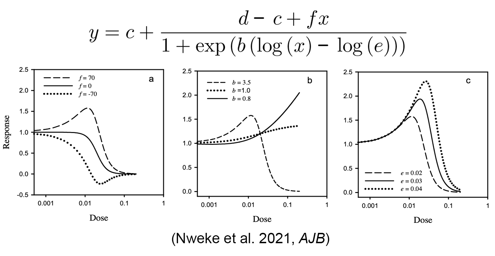
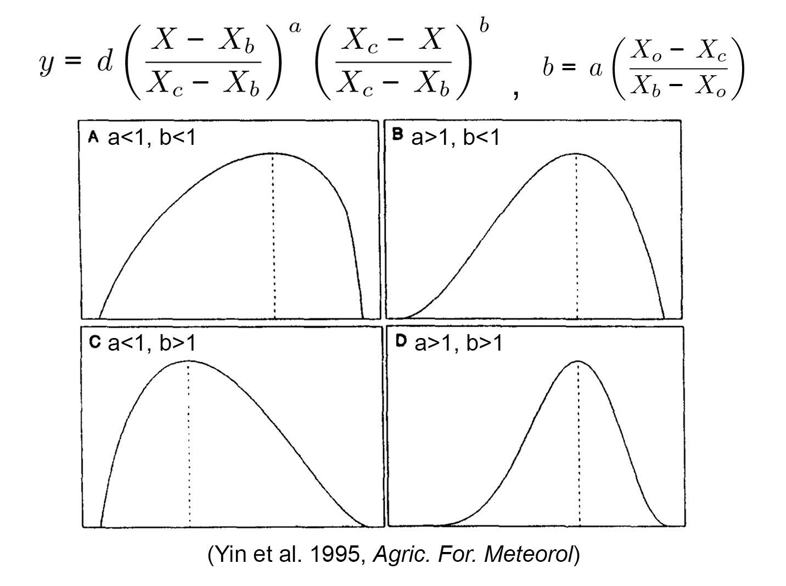

#### Biphasic Curves

The following models are used to describe the biphasic curves.

#### - Brain-Cousens models

The Brain-Cousens model is the modified version of Log-logistic model. The `f` is introduced into the classic Log-logistic model. `d` and `c` retain their interpretation as the upper and lower limit of the dose-response curve, while the other parameters lost their original biological meaning in the Log-logistic model. The curvature of the biphasic effect is described by `f`.  

#### - Beta models

The beta function is commonly used as a skewed probability density function in statistics, and it has been adapted to describe the bell-shaped dose-response curves. `a` and `b` are used to describe the curvatrue of curves.  

#### References

*Brain P, Cousens R (1989) An equation to describe dose responses where there is stimulation of growth at low doses. Weed Res 29: 93--96*\
*Cedergreen N, Ritz C, Streibig JC (2005) Improved empirical models describing hormesis. Environ Toxicol Chem 24: 3166--3172*\
*Nweke CO, Nwangwu OR, Ogbonna CJ, Okechi RN (2021) Statistical modeling of effective doses in hormetic dose-response relationships by reparameterization of a bilogistic model for inverted U-shaped curves. AJB 20: 451--464*\
*Yin X, Kropff MJ, McLaren G, Visperas RM (1995) A nonlinear model for crop development as a function of temperature. Agric For Meteorol 77: 1--16*\
*Yin X, Goudriaan J, Lantinga EA, Vos J, Spiertz HJ (2003) A Flexible Sigmoid Function of Determinate Growth. Ann Bot 91: 361--371*\
*Onofri A (2020) The broken bridge between biologists and statisticians: a blog and R package.*
