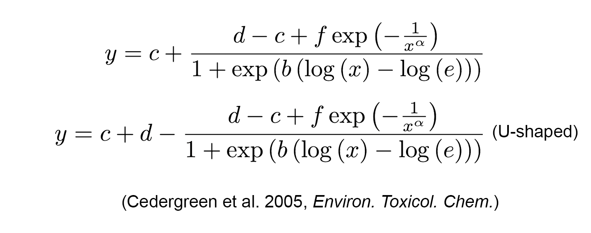

### Biphasic Curves

The following models are used to describe the biphasic curves.

#### - Brain-Cousens models

The Brain-Cousens model is the one of the earliest attempt scientists has been made to describe the biphasic curves. It is the modified version of Log-logistic model. The `f` is introduced into the classic Log-logistic model. `d` and `c` retain their interpretation as the upper and lower limit of the dose-response curve, while the other parameters lost their original biological meaning in the Log-logistic model. The curvature of the biphasic effect is described by `f`.  

#### - Cedergreen-Ritz-Streibig models

The Cedergreen-Ritz-Streibig model is a modified version of the Brain-Cousens model. It is more robust in handling data variation and can better describe both very large and relatively small hormetic effects. The improvement in this model comes from the introduction of a new parameter, `𝛼`, which controls the rate at which the hormetic effect manifests. However, since sufficient data are rarely available for the low end of the dose-response curve to reliably estimate `𝛼`, we fixed it at one of the three levels - 0.25, 0.5, or 1, as suggested. `d` and `c` retain their interpretation as the upper and lower limit of the dose-response curve,  while the remaining parameters lose their direct biological meaning. This model provides two equations, with the second specifically designed to describe u-shaped curves.  

#### References

*Brain P, Cousens R (1989) An equation to describe dose responses where there is stimulation of growth at low doses. Weed Res 29: 93--96*\
*Cedergreen N, Ritz C, Streibig JC (2005) Improved empirical models describing hormesis. Environ Toxicol Chem 24: 3166--3172*\
*Nweke CO, Nwangwu OR, Ogbonna CJ, Okechi RN (2021) Statistical modeling of effective doses in hormetic dose-response relationships by reparameterization of a bilogistic model for inverted U-shaped curves. AJB 20: 451--464*\
