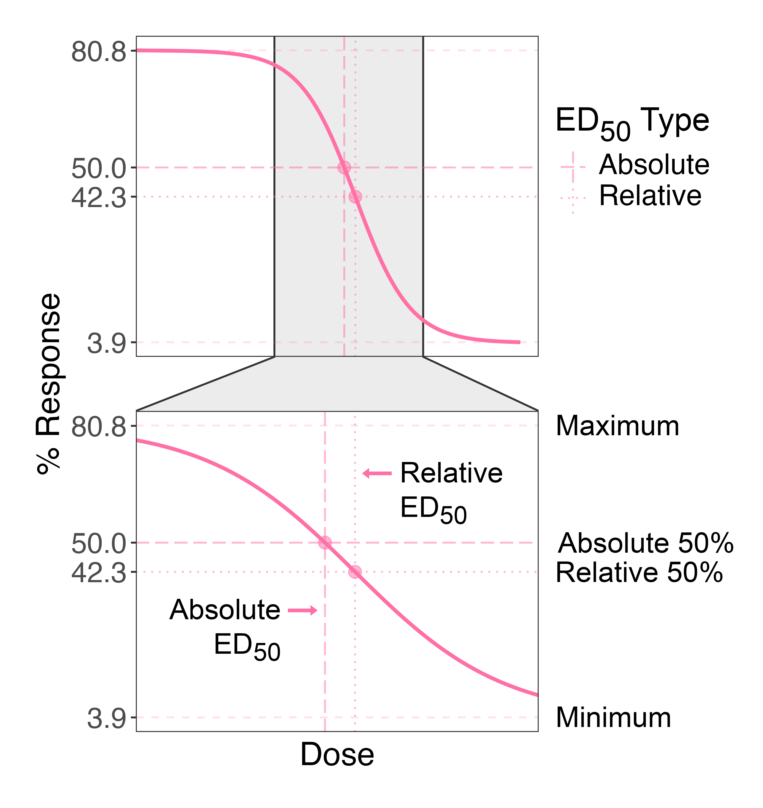
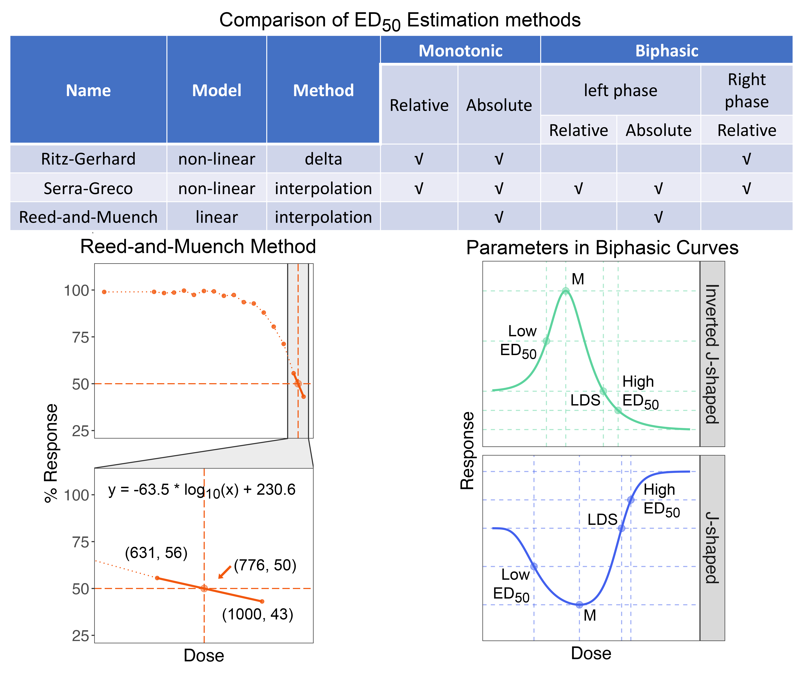

### ED Estimation Methods

#### - Type of ED~50~
In biological assays, two types of ED~50~s are commonly used: absolute and relative. These are illustrated in the following figure.  
•	**Relative ED~50~**: This is the dose that achieves 50% of the maximum response relative to the minimum. For instance, in the figure, if the maximum response is 80.8% and the minimum is 3.9%, the relative maximum response is 76.9% (80.8% - 3.9%). Therefore, the relative 50% response is 42.3% (76.9% / 2 + 3.9%).  
•	**Absolute ED~50~**: This is the dose that produces exactly a 50% response. It's meaningful only when the data is normalized against a control treatment.  

#### - ED~50~ Estimation Methods
You can estimate both the relative and absolute ED~50~s by using the build-in functions in the `drc` package, referred to here as the **Ritz-Gerhard Method**. This is best suited to standard sigmoidal or monotonic curves but not well-suited to biphasic or hormetic curves, which contain a rising phase and a falling phase. To address more complex scenarios, we introduced another two methods to estimate ED~50~s. One method is referred as **Serra-Greco Method** developed by Serra et al., while the other one was first introduced by Reed et al. in 1938 and further discussed by Ramakrishnan in 2016, which is known as the **Reed-and-Muench Method**. The differences between these three methods are summarized in the following table. When a curve does not fit any of the models, the Reed-and-Muench Method offers an absolute ED~50~ estimation by assuming linear regression between the two points that bracket the ED~50~ (see the accompanying figure). The primary advantage of the Serra-Greco Method is its effectiveness in estimating effective doses from biphasic curves. In such cases, effective doses such as LDS, M and ED~50~ are informative to researchers. The parameter M represents the dose that elicits the maximum stimulation, while LDS (limiting dose for stimulation) corresponds to the dose that gives the control response within the second phase of the curve. The estimation of ED~50~ values within both phases of the curve is essential. While the built-in function (Ritz-Gerhard Method) only provides the higher ED~50~, the Serra-Greco Method yields ED~50~ values for both sides, which are more reasonable, as shown in the figure below.  

#### References

*Sebaugh JL (2011) Guidelines for accurate EC50/IC50 estimation. Pharm Stat 10: 128–134*\
*Serra A. Et al. (2020) BMDx: a graphical Shiny application to perform Benchmark Dose analysis for transcriptomics data. Bioinformatics 36: 2932–2933*\
*Reed LJ, Muench H (1938) A simple method of estimating fifty percent endpoints. Am J Epidemiol 27: 493–497*\
*Ramakrishnan MA (2016) Determination of 50% endpoint titer using a simple formula. World J Virol 5: 85–86*
