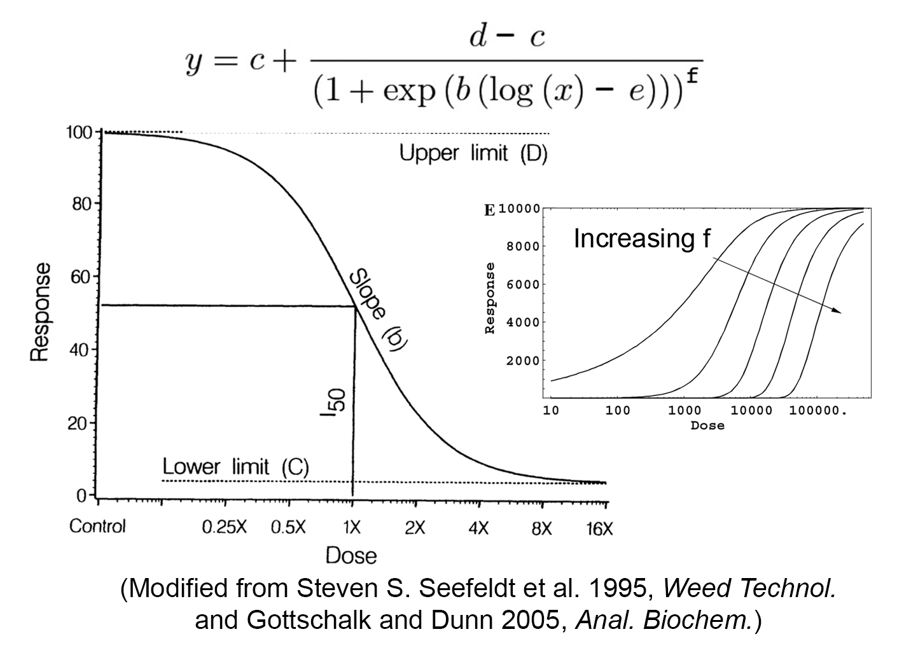
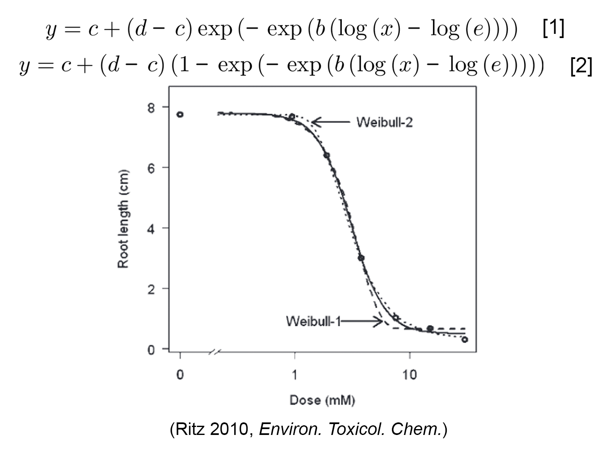

### Monotonic Curves

The following models are used to describe the monotonic curves. In the below formulae, y is the response and x is the dose/concentration.

#### - Log-logistic models

Log-logistic model has been frequently used to describe the typical sigmoidal dose-responsive curves.\
The function and demonstration of the curve is presented in the following plot. The parameters in the function are biologically meaningful, where `c` is the lower plateau of the curve (also known as the lower limit), `d` is the upper asymptote, `b` is the slope at inflection point of the curve, `e` is the estimated effective dose which gives the half of maximum response, and `f` is the parameter determining whether the curve is symmetric or not. We offer log-logistic models with either four or five parameters to describe symmetrical and asymmetrical curves separately. Additionally, you have the flexibility to define the lower or upper asymptotes according to your experimental design.  

#### - Weibull models

The two weibull models are used to describe the asymmetric dose-responsive curves. The Weibull I model [1] (long-dashed line) described the dose-response curve descends slowly from the upper limit, but on the other side, the curve approaches the lower limit rapidly. While the Weibull II model [2] (short-dashed line) described a different form of asymmetry with rapid change or descent from the upper limit, but a slow approach toward the lower limit. The parameters in the function are biologically meaningful, where `c` is the lower plateau of the curve (also known as the lower limit), `d` is the upper asymptote. Here we provide these two Weibull models, , with the flexibility to define the lower or upper asymptotes to align with your experimental design parameters.  

#### References

*Gottschalk PG, Dunn JR (2005) The five-parameter logistic: a characterization and comparison with the four-parameter logistic. Anal Biochem 343: 54--65*\
*Steven S. Seefeldt, Jens Erik Jensen, E. Patrick Fuerst (1995) Log-Logistic Analysis of Herbicide Dose-Response Relationships. Weed Technol 9: 218--227*\
*Ritz C (2010) Toward a unified approach to dose-response modeling in ecotoxicology. Environ Toxicol Chem 29: 220--229*
