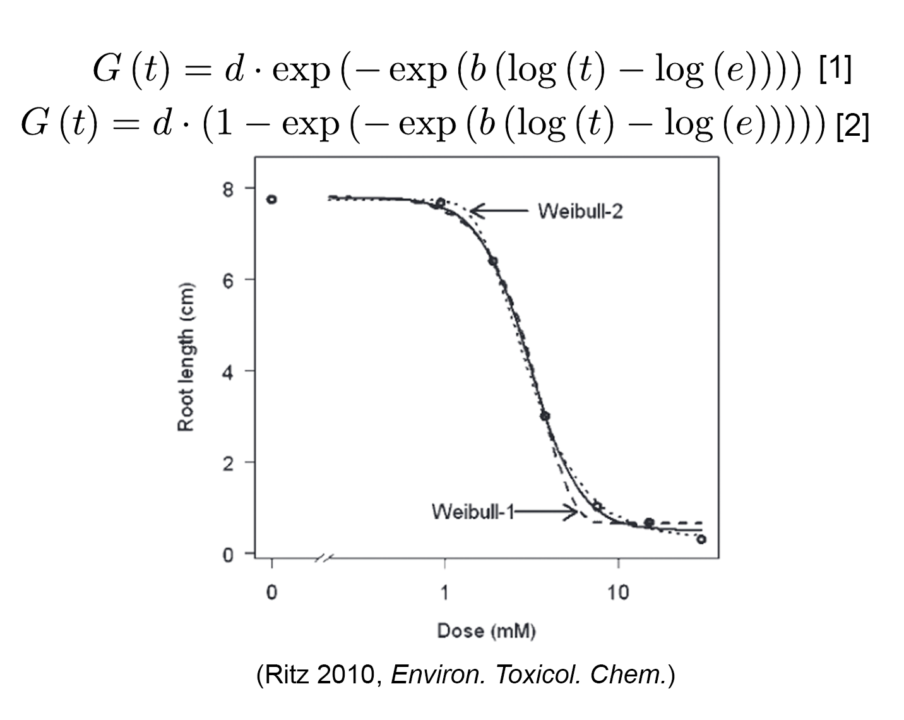
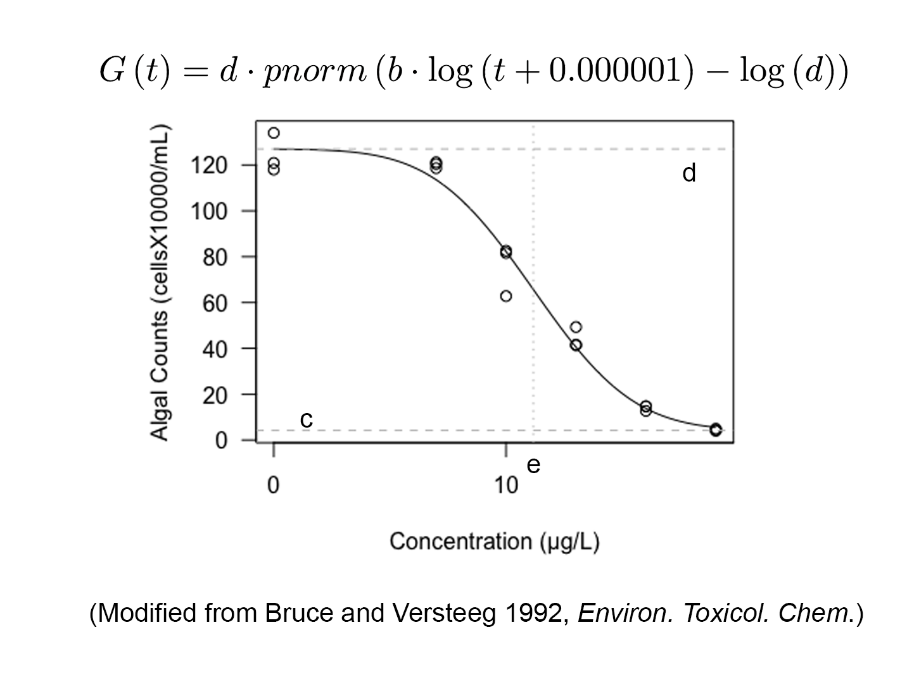
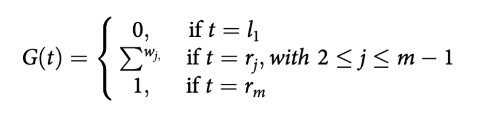
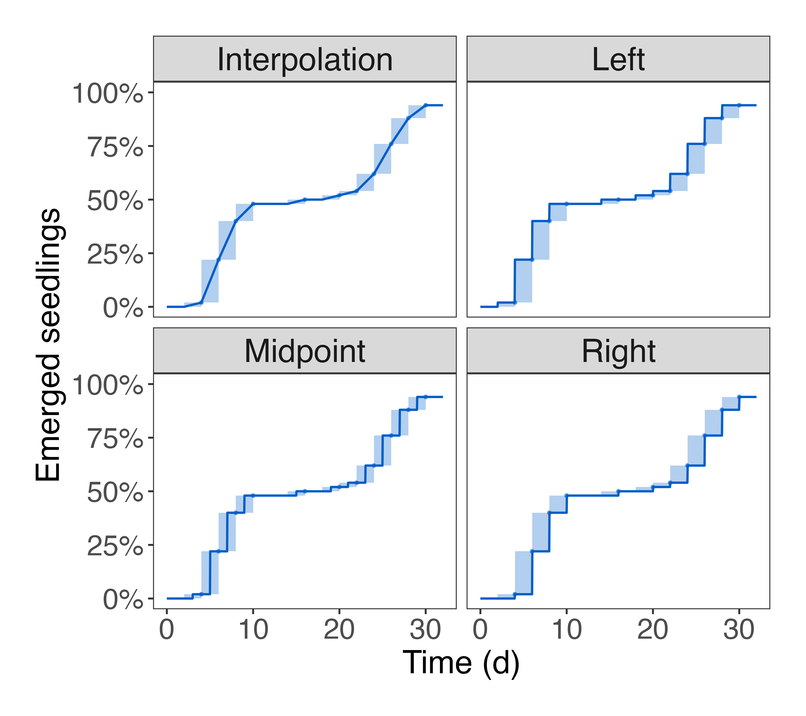
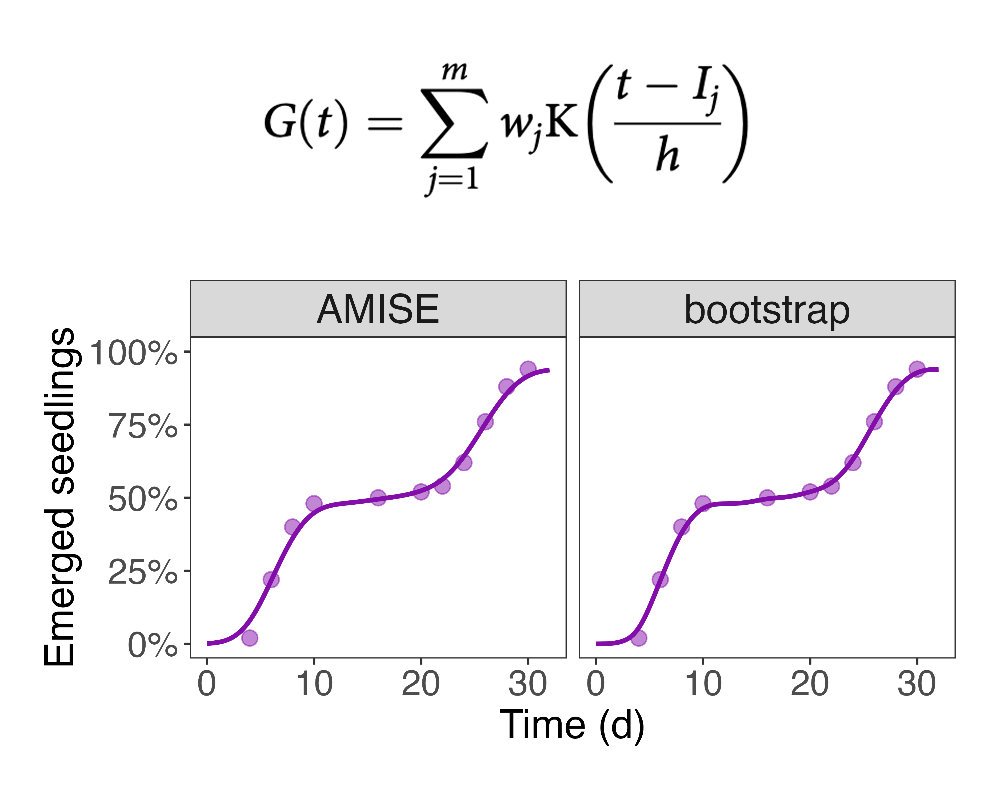

### Candidate models

When describing the time-to-event data, a cumulative distribution function (CDF) is commonly used. The CDF represents the probability P that the time-to-event T is equal to or less than any given time:  

G(t) = P(T ≤ t)

Here, G(t) corresponds to the proportion of individuals that experienced the event until time t. In germination assays, this is often referred to as "time-to-germination curve". To describe this curve, appropriate models can be selected based on its shape and the assumptions made about the observed data. Broadly, there are two types of models available for analyzing time-to-event data: parametric models and non-parametric models.  
  
#### Parametric models
In many cases, the time-to-event curve for a population can reasonably be described using a parametric model, denoted as Φ, which is based on a few meaningful parameters:

G(t) = d Φ(t, e, b)

Here, e is the location parameter, b is the shape parameter, and d represents the maximum fraction of individuals that experienced the event (0 < d ≤ 1). The term Φ can represent any parametric model, such as log-normal, log-logistic, or Weibull. Users can select a set of candidate models and allow the app to automatically determine the best-fit model for their data. By default, the app evaluates all applicable models to identify the best-fit model across a wide range of scenarios. However, this approach may lead to overfitting. Therefore, it is recommended that users empirically select a specific model based on their experimental objectives. The formulas for each model are provided below. For a detailed discussion of these models, please refer to the references listed at the end.  
  
##### - Log-logistic models

Log-logistic model has been frequently used to describe the typical sigmoidal distributions.\
The function and demonstration of the curve is presented in the following plot. The parameters in the function are biologically meaningful, where `c` is the lower plateau of the curve (also referred to as the lower limit, which is always zero in time-to-event data), `d` is the upper asymptote (also known as the upper limit). We offer a four-parameter log-logistic model, allowing you the option to fix the upper limit at 100% or leave it unspecified (as NA).  

##### - Weibull models

The two weibull models are used to describe the asymmetric distributions. The Weibull I model [1] (long-dashed line) described the curve descends slowly from the upper limit, but on the other side, the curve approaches the lower limit rapidly. While the Weibull II model [2] (short-dashed line) described a different form of asymmetry with rapid change or descent from the upper limit, but a slow approach toward the lower limit. We provide two Weibull models, allowing you to either fix the upper limit at 100% or keep it undefined (as NA).  

##### - Log-normal models

The log-normal models are introduced by Bruce and Versteeg, and it has been used for a long time for modeling quantal dose-response data. Nowadays, it is modified as the following equation, where `pnorm` is the cumulative distribution function of the standard normal distribution. The other parameters in the function are biologically meaningful, where `c` is the lower plateau of the curve (also known as the lower limit, which is always zero in time-to-event data), `d` is the upper asymptote, and `e` is the estimated time which gives the half of maximum response. We offer this model with the flexibility to set the upper limit to 100% or designate it as unspecified (NA).  

#### Nonparametric models
Parametric models impose strict assumptions about the shape of the time-to-event curve, which may not be realistic in certain cases—such as when the curve exhibits a staircase-like pattern. In such situations, it is more appropriate to use a time-to-event model that makes fewer a priori assumptions about the curve's shape. To address these cases, we have introduced the following two nonparametric models to better describe such atypical data.  
  
##### - NPMLE model
The NPMLE model, introduced by Fay and Shaw in 2010, utilizes an expectation-maximization algorithm to estimate the non-parametric maximum likelihood estimator (NPMLE) for time-to-event data. This model is based on a set of m unique and non-overlapping time intervals, referred to as Turnbull's intervals, denoted as Ij = (lj, rj), where j ranges from 1 to m. In this notation, lj and rj represent the left and right boundaries of the interval, respectively. Each time interval is associated with a probability that the event occurs within the jth interval.  
The resulting time-to-event curve can conceptually be regarded as model parameters:  

  
  

  
Here, wj = P(lj < t ≤ rj) represents the probability mass for the jth time interval.  
A key characteristic of this model is that the time-to-event curve is only defined at the end of each interval and is undefined elsewhere. As a result, it is often visualized as a shaded area (see the figure below). However, the curve is not unique within each interval.  
The "Type" of the NPMLE model specifies how the cumulative distribution function (CDF) increases within each interval. The possible values for "Type" and the output curves are as follows:  

•	"interpolation": Assumes the CDF increases progressively throughout the interval.  
•	"left": Assumes the CDF increases at the beginning of each interval.  
•	"right": Assumes the CDF increases at the end of each interval (commonly used in survival analysis).  
•	"midpoint": Assumes the CDF increases in the middle of each interval (also common in survival analysis).

##### - KDE model
The NPMLE model is highly flexible and can describe a wide variety of time-to-event curve shapes. However, using a "broken-stick" model to represent a continuous phenomenon may not always be ideal, particularly when a smooth curve is preferred for purposes such as prediction. To address this, the KDE (Kernel Density Estimation) model, proposed by Barreiro-Ures et al. in 2019, was introduced. This model uses a kernel density estimator (KDE) to generate a smooth cumulative distribution function (CDF) without assuming a predefined shape:  

  
  

    
Here, Ij = (lj + rj)/2 represents the center of each interval, K is a Gaussian kernel function, and h is the bandwidth parameter. The bandwidth (h) controls the degree of smoothing, determining how closely the CDF follows the observed data.  
We implement two methods available in drcte package to estimate the bandwidth:  

•	AMISE (Asymptotic Mean Integrated Squared Error): This method is computationally efficient and is used as the default method.  
•	bootstrap method: This approach is more computationally intensive but provides reliable bandwidth estimation.  
Both methods produce curves that fit the observed data well, but AMISE is preferred as the default due to its lower computational cost.  

#### References

*Onofri A, Mesgaran MB, Ritz C (2022) A unified framework for the analysis of germination, emergence, and other time-to-event data in weed science. Weed Sci.70:259–71*\
*Fay MP, Shaw PA (2010) Exact and Asymptotic Weighted Logrank Tests for Interval Censored Data: The interval R package. J Stat Softw 36:i02*\
*Barreiro-Ures D, et al (2019) Analysis of interval-grouped data in weed science: The binnednp Rcpp package. Ecol Evol 9:10903–15*\
*Gottschalk PG, Dunn JR (2005) The five-parameter logistic: a characterization and comparison with the four-parameter logistic. Anal Biochem 343: 54--65*\
*Steven S. Seefeldt, Jens Erik Jensen, E. Patrick Fuerst (1995) Log-Logistic Analysis of Herbicide Dose-Response Relationships. Weed Technol 9: 218--227*\
*Ritz C (2010) Toward a unified approach to dose-response modeling in ecotoxicology. Environ Toxicol Chem 29: 220--229*\
*Bruce RD, Versteeg DJ (1992) A statistical procedure for modeling continuous toxicity data. Environ Toxicol Chem 11: 1485–1494*
