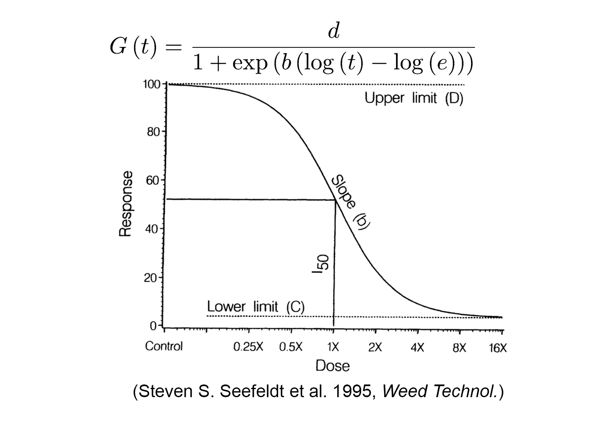

#### Monotonic Curves

The following models are used to describe the monotonic curves. In the below formulae, y is the response and x is the dose/concentration.

#### - Log-logistic models

Log-logistic model has been frequently used to describe the typical sigmoidal curves.\
The function and demonstration of the curve is presented in the following plot. The parameters in the function are biologically meaningful, where `c` is the lower plateau of the curve (also known as the lower limit), `d` is the upper asymptote, `b` is the slope at inflection point of the curve, and `e` is the estimated time which gives the half of maximum response. "LL.2" and "LL.3" provide the log-logistic functions with different number of fixed parameters.  
LL.2: c = 0, d = 1  
LL.3: c = 0  

#### - Weibull models

The two weibull models are used to describe the asymmetric curves. The Weibull-1 model [1] (long-dashed line) described the curve descends slowly from the upper limit, but on the other side, the curve approaches the lower limit rapidly. "W1.2" and "W1.3" provide this model with the different number of fixed parameters. While the Weibull-2 model [2] (short-dashed line) described a different form of asymmetry with rapid change or descent from the upper limit, but a slow approach toward the lower limit. "W2.2" and "W2.3" provide this model with the different number of fixed parameters.  
W1.2/W2.2: c = 0, d = 1  
W1.3/W2.3: c = 0  

#### - Log-normal models

The two log-normal models are introduced by Bruce and Versteeg, and it has been used for a long time for modeling quantal dose-response data. Nowadays, it is modified as the following equation, where `Φ` is the cumulative distribution function of the standard normal distribution. The other parameters in the function are biologically meaningful, where `c` is the lower plateau of the curve (also known as the lower limit), `d` is the upper asymptote, and `e` is the estimated time which gives the half of maximum response. "LN.2" and "LN.3" provide the log-normal functions with different number of fixed parameters. 
LN.2: c = 0, d = 1  
LN.3: c = 0  

#### References

*Gottschalk PG, Dunn JR (2005) The five-parameter logistic: a characterization and comparison with the four-parameter logistic. Anal Biochem 343: 54--65*\
*Steven S. Seefeldt, Jens Erik Jensen, E. Patrick Fuerst (1995) Log-Logistic Analysis of Herbicide Dose-Response Relationships. Weed Technol 9: 218--227*\
*Ritz C (2010) Toward a unified approach to dose-response modeling in ecotoxicology. Environ Toxicol Chem 29: 220--229*
*Bruce RD, Versteeg DJ (1992) A statistical procedure for modeling continuous toxicity data. Environ Toxicol Chem 11: 1485–1494*
