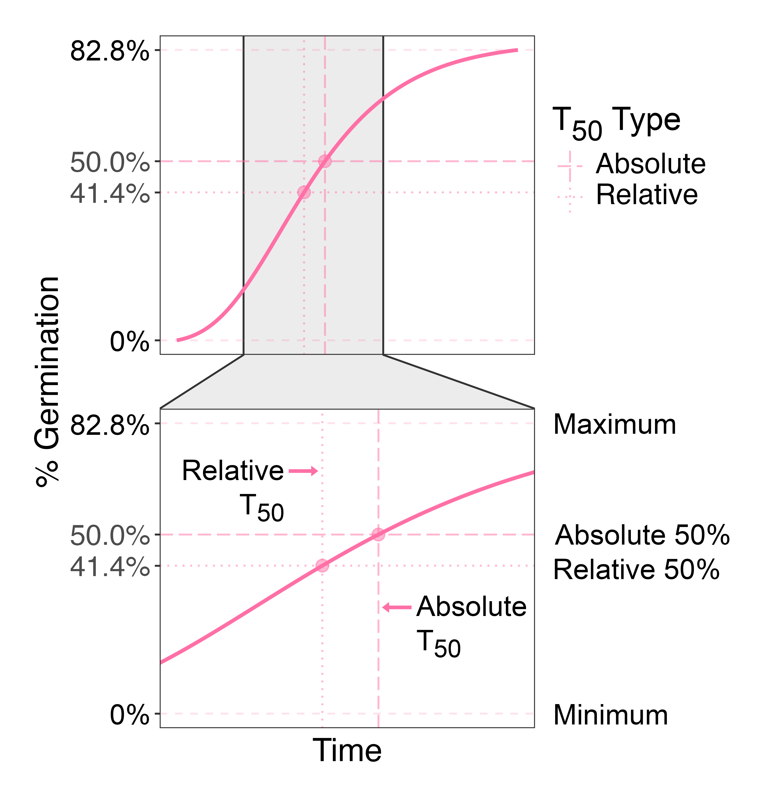

### Type of T~50~
As a concept closely related to ED~50~, two types of T~50~ values can also be inferred from time-to-event studies: absolute T~50~ and relative T~50~. Absolute T~50~ is calculated based on the entire sample, whereas relative T~50~ is calculated only for the fraction of individuals that have experienced the event of interest.  
For example, in germination assays, if some seeds fail to germinate by the final time interval, it is more appropriate to calculate absolute T~50~, as it accounts for all the tested seeds. On the other hand, relative T~50~ is valid if independent data confirm that the experiment has run long enough to accurately capture the maximum germination rate—indicating that the ungerminated seeds will not germinate.  
The differences between these two types of T~50~ are illustrated in the following example.  
•	**Relative T~50~**: This is the time that achieves 50% of the maximum response relative to the minimum. For instance, in the following figure, the maximum response is 82.8% and the minimum is 0%, the relative maximum response is 82.8%. Therefore, the relative 50% response is 41.4% (82.8% / 2).  
•	**Absolute T~50~**: This is the time that produces exactly a 50% response.  

#### References

*Onofri A, Mesgaran MB, Ritz C (2022) A unified framework for the analysis of germination, emergence, and other time-to-event data in weed science. Weed Sci.70:259–71*
