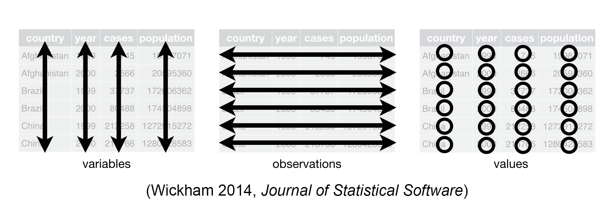
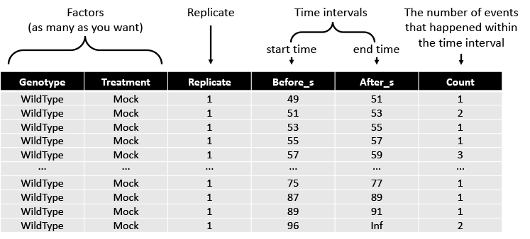

#### Format of Input Data

The data should be in tidy format. The tidy dataset should follow the following three rules.
1. Each variable must have its own column.
2. Each observation must have its own row.
3. Each value must have its own cell. The following figure shows the rules visually.
You may learn more about the tidy format [here](https://r4ds.had.co.nz/tidy-data.html).

------------------------------------------------------------------------

The column order of the data should also be arranged as follows:\
Factors (e.g. Protein, Compound),Replicate, Before, After, Count. The figure showed the arrangement visually.

#### Reference

*Wickham H (2014) Tidy Data. Journal of Statistical Software, Articles 59: 1--23*
